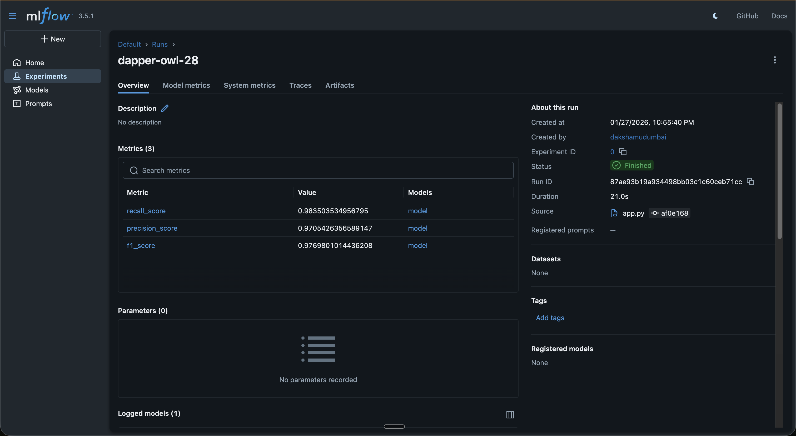
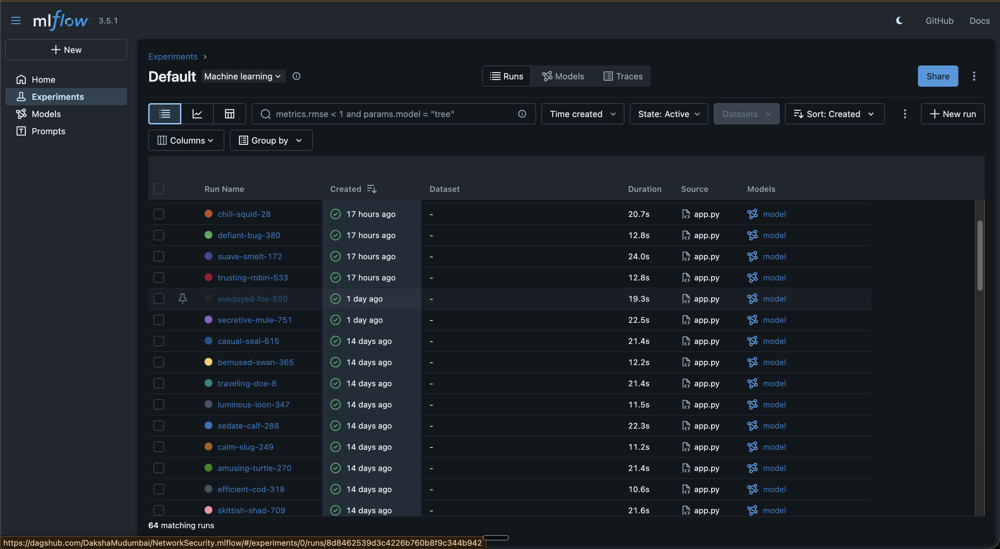
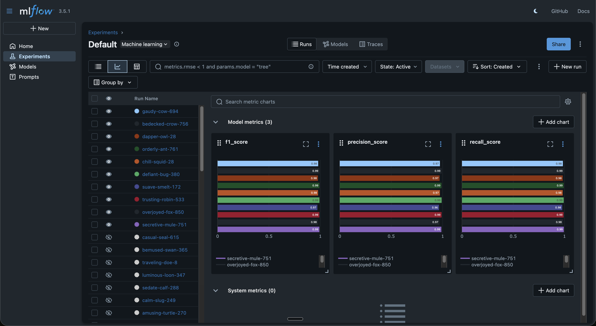

# 🛡️ Network Security Mechanism

A machine learning system for detecting phishing URLs using features extracted from URL structure, domain properties, and web page characteristics. Built on the UCI Phishing Websites Dataset, the model analyzes 30 attributes including URL length, use of IP addresses, SSL state, domain registration length, and page rank to classify websites as legitimate or malicious.
This project implements an end-to-end MLOps pipeline covering data ingestion, validation, transformation, model training, and evaluation. The trained model is served via a FastAPI application deployed on AWS EC2, with full experiment tracking through MLflow and DagsHub.


## 🔗 Quick Links

| Resource | Link |
|----------|------|
| **Live API** | [http://54.167.110.229:8080/docs](http://54.167.110.229:8080/docs) |
| **Experiment Tracking** | [DagsHub MLflow](https://dagshub.com/DakshaMudumbai/NetworkSecurity.mlflow) |

> **Try both:** Use the Live API to test phishing predictions, then check Experiment Tracking to see the 64+ training runs and model metrics behind it.

## 🌐 Demo

**Try it now:** [http://54.167.110.229:8080/docs](http://54.167.110.229:8080/docs)

The API is deployed on AWS EC2 and provides two main functions:

| Endpoint | What it does |
|----------|--------------|
| `GET /train` | Triggers the full training pipeline. Model metrics are automatically logged to MLflow. |
| `POST /predict` | Upload a CSV file and receive phishing predictions for each URL. |

### How to Test Predictions

1. Download the sample file: [`valid_data/test.csv`](valid_data/test.csv)
2. Open the [Swagger UI](http://54.167.110.229:8080/docs) and expand the `/predict` endpoint
3. Click **Try it out** → **Choose File** → Upload the CSV → **Execute**
4. The response displays an HTML table with your original data plus a `predicted_column`:
   - `1.0` → Phishing / Malicious
   - `0.0` → Legitimate

> **Note:** The EC2 instance may be stopped occasionally to manage AWS costs. If unavailable, check back later or run locally using the instructions below.

---

## 📊 Experiment Tracking

All training runs are tracked using **MLflow** hosted on **DagsHub**, providing full visibility into model performance and versioning.

**🔗 View Experiments:** [https://dagshub.com/DakshaMudumbai/NetworkSecurity.mlflow](https://dagshub.com/DakshaMudumbai/NetworkSecurity.mlflow)

### Model Performance

The current model achieves strong performance across key classification metrics:

| Metric | Score |
|--------|-------|
| F1-Score | 97.7% |
| Precision | 97.1% |
| Recall | 98.4% |

### Experiment Runs

Over 64 training runs were conducted during development. Each run logs metrics, parameters, and model artifacts automatically.



### Metrics Comparison

Visual comparison of F1, Precision, and Recall across training iterations:



### Run Details

Each experiment captures detailed metrics and model artifacts for reproducibility:



---

## 🔧 Tech Stack

**Core:** Python 3.10+, FastAPI, Scikit-learn, Pandas, NumPy, MongoDB Atlas

**MLOps & Infrastructure:** MLflow, DagsHub, Docker, GitHub Actions, AWS (ECR, EC2)

---

## 📂 Project Structure

```
NetworkSecurity/
├── networksecurity/          # Main package
│   ├── components/           # Pipeline stages (ingestion, validation, transformation, training)
│   ├── pipeline/             # Training and prediction pipelines
│   ├── entity/               # Configuration and data classes
│   ├── constants/            # Project-wide constants
│   ├── utils/                # Helper functions
│   └── exception/            # Custom exception handling
├── assets/                   # MLflow screenshots for documentation
├── valid_data/               # Sample test data
├── .github/workflows/        # CI/CD pipeline definitions
├── app.py                    # FastAPI application entry point
├── Dockerfile                # Container configuration
├── requirements.txt          # Python dependencies
└── README.md
```

---

## ⚙️ Local Setup

### Prerequisites

- Python 3.8+
- MongoDB connection string
- AWS credentials (optional, for cloud features)
- DagsHub token (optional, for experiment tracking)

### Installation

Clone the repository and set up your environment:

```bash
git clone https://github.com/DakshaMudumbai/NetworkSecurity.git
cd NetworkSecurity

conda create -n networksecurity python=3.10 -y
conda activate networksecurity

pip install -r requirements.txt
```

Create a `.env` file in the root directory:

```env
MONGO_DB_URL="your_mongodb_connection_string"
AWS_ACCESS_KEY_ID="your_aws_access_key"
AWS_SECRET_ACCESS_KEY="your_aws_secret_key"
AWS_REGION="us-east-1"
DAGSHUB_TOKEN="your_dagshub_token"
```

Run the application:

```bash
python app.py
```

The API will be available at `http://localhost:8000/docs`.

---

## 🐳 Docker

Build and run locally:

```bash
docker build -t networksecurity .
docker run -p 8080:8000 --env-file .env networksecurity
```

---

## 🔄 CI/CD Pipeline

The project uses GitHub Actions for automated deployment:

**Continuous Integration** — On push to `main`, the pipeline runs linting and tests.

**Continuous Delivery** — Builds a Docker image and pushes it to AWS Elastic Container Registry.

**Continuous Deployment** — Pulls the latest image on the EC2 instance, stops the previous container, and deploys the updated version.

---

## 🤝 Contributing

1. Fork the repository
2. Create a feature branch (`git checkout -b feature/your-feature`)
3. Commit your changes (`git commit -m 'Add your feature'`)
4. Push to the branch (`git push origin feature/your-feature`)
5. Open a Pull Request

---

## 📬 Contact

**Daksha Mudumbai**

[LinkedIn](https://linkedin.com/in/daksha-mudumbai/) · mudumbaid@gmail.com
